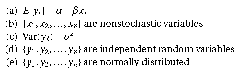

Link to dataset used : https://www.kaggle.com/uciml/breast-cancer-wisconsin-data

# Problem Definition
We are interested in the factors that we can use to potentially predict whether a tumor is malignant or benign. We will try to create a model that can use an input of different variables in order to achieve an accurate prediction.


##################################################################################################

# Data Dictionary
id                             ID Number
Diagnosis                      The diagnosis of breast tissues (M = malignant, B = benign)
radius_mean                    mean of distances from center to points on the perimeter
texture_mean                   standard deviation of gray-scale values
perimeter_mean                 mean size of the core tumor
area_mean                      no description given
smoothness_mean                mean of local variation in radius lengths
compactness_mean               mean of perimeter^2 / area - 1.0
concavity_mean                 mean of severity of concave portions of the contour
concave points_mean            mean for number of concave portions of the contour
symmetry_mean                  no description given
fractal_dimension_mean         mean for "coastline approximation" - 1
radius_se                      standard error for the mean of distances from center to points on the perimeter
texture_se                     standard error for standard deviation of gray-scale values
perimeter_se                   no description given
area_se                        no description given
smoothness_se                  standard error for local variation in radius lengths
compactness_se                 standard error for perimeter^2 / area - 1.0
concavity_se                   standard error for severity of concave portions of the contour
concave points_se              standard error for number of concave portions of the contour
symmetry_se                    no description given
fractal_dimension_se           standard error for "coastline approximation" - 1
radius_worst                   "worst" or largest mean value for mean of distances from center to points on the perimeter
texture_worst                  "worst" or largest mean value for standard deviation of gray-scale values
perimeter_worst                no description given
area_worst                     no description given
smoothness_worst               "worst" or largest mean value for local variation in radius lengths
compactness_worst              "worst" or largest mean value for perimeter^2 / area - 1.0
concavity_worst                "worst" or largest mean value for severity of concave portions of the contour
concave points_worst           "worst" or largest mean value for number of concave portions of the contour
symmetry_worst                 no description given
fractal_dimension_worst        "worst" or largest mean value for "coastline approximation" - 1

##################################################################################################


# Load data into R

## Set Working Directory
```{r}
setwd("C:\\Users\\Daniel\\Documents\\R Codes\\Breast Cancer Project")
```

## Load CSV File
```{r}
bcdata <- read.csv("bcdata.csv")

# Remove id and X tab as it is not necessary.

bcdata <- bcdata[,-1]
bcdata <- bcdata[,-32]

# Change diagnosis parameter from Malignant(M) and Benign(B) to Breast Cancer Present (1) or No Breast Cancer (0).


bcdata$diagnosis[bcdata$diagnosis == "B"] <- 0         # Change parameters.
bcdata$diagnosis[bcdata$diagnosis == "M"] <- 1
bcdata$diagnosis <- as.numeric(bcdata$diagnosis)       # Change from character to numeric.

summary(bcdata)

```
## Data Exploration
```{r}
bcfit1 <- lm(diagnosis ~., data = bcdata)

summary(bcfit1)

# Using all the data points does not lead to a good linear regression model.

# It does not make sense to use data points such as radius standard error or area standard error. So we will omit all of these data points aside from the means.

# For the same reason we will omit the "worst" data points, as those just give the largest values for their respective means.


# We will look at what the graph looks like using only the mean data points

bcfit1 <- lm(diagnosis ~ radius_mean + texture_mean + perimeter_mean + area_mean + smoothness_mean + compactness_mean + concavity_mean + concave.points_mean + symmetry_mean + fractal_dimension_mean, data = bcdata)

summary(bcfit1)

# The model is much better, but we must use some transformations in order for the model to be viable.

# Change the variable to only include mean data points.

bcdata <- bcdata[1:11]
summary(bcdata)
```

# Identify and Remove Potential Outliers

# With our variables selected, plot each one to determine if there are any outliers that need removing.
```{r}
# Eliminate Radius Outliers
dev.new(width = 6, height = 4)

plot(radius_mean ~ diagnosis, data = bcdata) # Plot before outlier removal.

# From these plots we can see that there are some outliers within our data that we will have to remove.

radius_outliers <- boxplot(bcdata$radius_mean, plot=FALSE)$out
bcdata <- bcdata[-which(bcdata$radius_mean %in% radius_outliers), ]

plot(radius_mean ~ diagnosis, data = bcdata) # Plot after outlier removal.

# We can see from the before and after plots that there are outliers that we need to eliminate. We will repeat this process for the other variables.
```


```{r}
# Eliminate Texture Outliers
plot(texture_mean ~ diagnosis, data = bcdata) # Plot before outlier removal.

texture_outliers <- boxplot(bcdata$texture_mean, plot=FALSE)$out
bcdata <- bcdata[-which(bcdata$texture_mean %in% texture_outliers), ]

plot(texture_mean ~ diagnosis, data = bcdata) # Plot after outlier removal.
```


```{r}
# Eliminate Perimeter Outliers
plot(perimeter_mean ~ diagnosis, data = bcdata) # Plot before outlier removal.

perimeter_outliers <- boxplot(bcdata$perimeter_mean, plot=FALSE)$out
bcdata <- bcdata[-which(bcdata$perimeter_mean %in% perimeter_outliers), ]

plot(perimeter_mean ~ diagnosis, data = bcdata) # Plot after outlier removal.
```


```{r}
# Eliminate Area Outliers
plot(area_mean  ~ diagnosis, data = bcdata) # Plot before outlier removal.

area_outliers <- boxplot(bcdata$area_mean, plot=FALSE)$out
bcdata <- bcdata[-which(bcdata$area_mean %in% area_outliers), ]

plot(area_mean  ~ diagnosis, data = bcdata) # Plot after outlier removal.
```


```{r}
# Eliminate Smoothness Outliers
plot(smoothness_mean  ~ diagnosis, data = bcdata) # Plot before outlier removal.

smoothness_outliers <- boxplot(bcdata$smoothness_mean, plot=FALSE)$out
bcdata <- bcdata[-which(bcdata$smoothness_mean %in% smoothness_outliers), ]

plot(smoothness_mean  ~ diagnosis, data = bcdata) # Plot after outlier removal.
```


```{r}
# Eliminate Compactness Outliers
plot(compactness_mean  ~ diagnosis, data = bcdata) # Plot before outlier removal.

compactness_outliers <- boxplot(bcdata$compactness_mean, plot=FALSE)$out
bcdata <- bcdata[-which(bcdata$compactness_mean %in% compactness_outliers), ]

plot(compactness_mean  ~ diagnosis, data = bcdata) # Plot after outlier removal.
```


```{r}
# Eliminate Concavity Outliers
plot(concavity_mean ~ diagnosis, data = bcdata) # Plot before outlier removal.

concavity_outliers <- boxplot(bcdata$concavity_mean, plot=FALSE)$out
bcdata <- bcdata[-which(bcdata$concavity_mean %in% concavity_outliers), ]

plot(concavity_mean ~ diagnosis, data = bcdata) # Plot after outlier removal.
```


```{r}
# Eliminate Concave.Points Outliers
plot(concave.points_mean   ~ diagnosis, data = bcdata) # Plot before outlier removal.


concave.points_outliers <- boxplot(bcdata$concave.points_mean, plot=FALSE)$out
bcdata <- bcdata[-which(bcdata$concave.points_mean %in% concave.points_outliers), ]

plot(concave.points_mean ~ diagnosis, data = bcdata) # Plot after outlier removal.
```


```{r}
# Eliminate Symmetry Outliers
plot(symmetry_mean ~ diagnosis, data = bcdata) # Plot before outlier removal.

symmetry_outliers <- boxplot(bcdata$symmetry_mean, plot=FALSE)$out
bcdata <- bcdata[-which(bcdata$symmetry_mean %in% symmetry_outliers), ]

plot(symmetry_mean ~ diagnosis, data = bcdata) # Plot after outlier removal.
```


```{r}
# Eliminate Fractal Dimension Outliers
plot(fractal_dimension_mean ~ diagnosis, data = bcdata) # Plot before outlier removal.

fractal_dimension_outliers <- boxplot(bcdata$fractal_dimension_mean, plot=FALSE)$out
bcdata <- bcdata[-which(bcdata$fractal_dimension_mean %in% fractal_dimension_outliers), ]

plot(fractal_dimension_mean ~ diagnosis, data = bcdata) # Plot after outlier removal.
```


```{r}
# Let's see how the linear model looks without the outliers.
bcfit1 <- lm(diagnosis ~., data = bcdata) 
summary(bcfit1)
plot(bcfit1)

# We see improvement in the linear model as well as the plots of residuals as they become more uniformly distributed, but they still can be improved upon by using transformations to make sure we do not violate any necessary statistical assumptions.
```

#Split the data into a "Training" and a "Test" Set

```{r}
library(caret)
set.seed(3) # Set seed to keep results consistent across R sessions.
trnId <- createDataPartition(bcdata$diagnosis, p = 0.7, list = FALSE) # Split the data 70% training, 30% test.
bcdataTrain <- bcdata[trnId,]
bcdataTest <- bcdata[-trnId,]

summary(bcdataTrain$diagnosis) # Take summaries to see if they have similar structure.
summary(bcdataTest$diagnosis)

nrow(bcdataTrain) # Check lengths of the number of data points.
nrow(bcdataTest)
```


#Create Different Linear Models Using 'Logit' and 'Probit' Transformations

```{r}
# Create a 'Logit' transformation on the data.
bcfitlogit <- glm(formula = diagnosis~., family = binomial(link = "logit"), data = bcdataTrain)

summary(bcfitlogit)
plot(bcfitlogit)
```

```{r}
# Create a 'Logit' transformation on the data.
bcfitprobit <- glm(formula = diagnosis~., family = binomial(link = "probit"), data = bcdataTrain)

summary(bcfitprobit)
plot(bcfitprobit)
```


```{r}
# The transformation models summaries do not look good. Few variables carry statistical significance. Take a look at a linear regression model to see results.
bcfitlinear <- lm(diagnosis ~., data = bcdataTrain)

summary(bcfitlinear)
plot(bcfitlinear)

# The plot of residuals look much better using the link functions 'logit' and 'probit', the variables have much more significance when using a linear model. This may be due to the relatively low sample size in the training set. Thus we will continue with each of the models to determine which gives the best accuracy.
```


#Create Predictions and Test the Model.
```{r}
# Create a function that we will use to determine the accuracy of our model.
# Sums together the true positives and true negatives, and divides this value by the total number of observations.
calACC <- function(p1, p2) {
  
  return(sum(diag(table(p1, p2))) / length(p1))

}
```


```{r}
predictyhat <- predict(bcfitlinear, newdata = bcdataTest, type = "response") # Predict the values of the Test set, using the current linear regression model.
yhat <- ifelse (predictyhat < 0.5, 0, 1) # If the predicted value of the Test set is less than 0.5, set it to 0. If it is greater than 0.5, set it to 1. This is because our target is either benign (0) or malignant (1).
calACC(yhat,bcdataTest$diagnosis) # Calculate the accuracy of the model when comparing to the Test Data Set.

table(bcdataTest$diagnosis, yhat) # Confusion matrix of results.

data.frame(Observed = bcdataTest$diagnosis, Predicted = yhat) # Chart of the predictions versus the real outcomes.

# We can see that the linear regression model conducts a 90.5% accuracy.
```


```{r}
predictyhatl <- predict(bcfitlogit, newdata = bcdataTest, type = "response") # Predict the values of the Test set, using the current linear regression model.
yhatl <- ifelse (predictyhatl < 0.5, 0, 1) # If the predicted value of the Test set is less than 0.5, set it to 0. If it is greater than 0.5, set it to 1. This is because our target is either benign (0) or malignant (1). 

calACC(yhatl,bcdataTest$diagnosis)

# The logit fit model also holds a high accuracy in predicting breast cancer at 89.8%. Let's compare this to the probit link function predictions.
```

```{r}
predictyhatp <- predict(bcfitprobit, newdata = bcdataTest, type = "response") # Predict the values of the Test set using the current linear regression model.
yhatp <- ifelse (predictyhatp < 0.5, 0, 1) # If the predicted value of the Test set is less than 0.5, set it to 0. If it is greater than 0.5, set it to 1. This is because our target is either benign (0) or malignant (1). 

calACC(yhatp,bcdataTest$diagnosis)
table(bcdataTest$diagnosis, yhatp) 

# The probit model holds the same accuracy as the linear regression model of 90.5%. A confusion matrix was made to make sure that they do not yield the same results and to check for errors.
# The probit model is the best model that we will use as it ensures that we do not violate any statistical assumptions by applying transformations on the data and making the outcomes more normally distributed.
```


# Final Thoughts
We managed to create a generalized linear model using the probit link function in order to create a model that can predict a benign or malignant tumor with 90.5% accuracy. By selecting this model over the other two we have developed, we obtain the best accuracy and avoid any statistical assumptions as listed here: 

Thus we will use the link function probit generalized linear model as our model for predicting whether an individual has a benign tumor (B or 0) or a malignant, cancerous tumor (M or 1).


